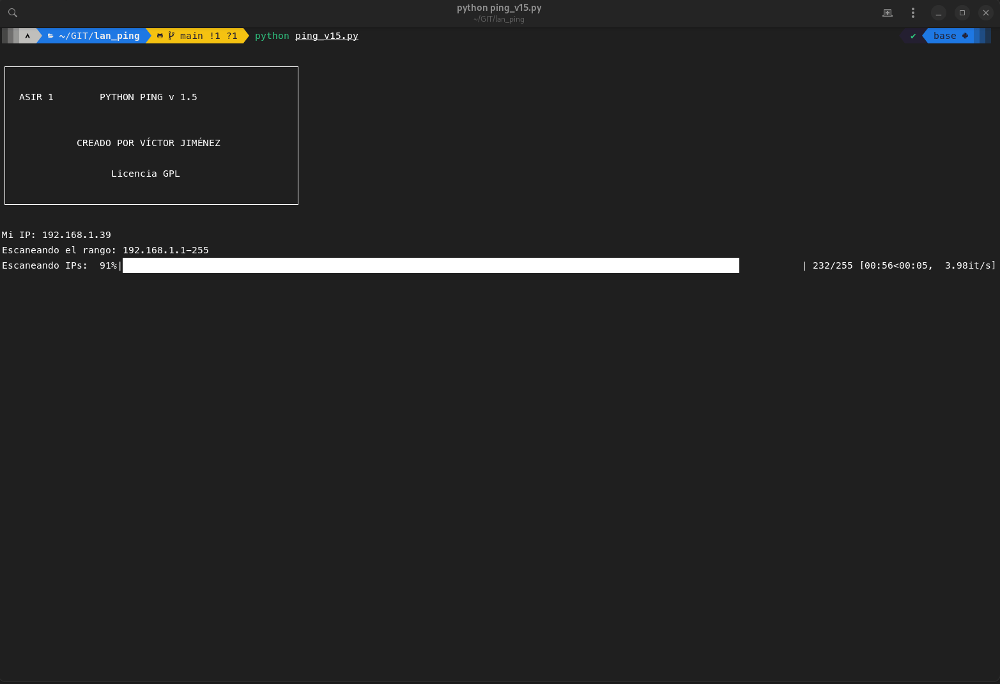

# Ping Scanner

This Python script is a simple network scanner that pings all the IP addresses in the same subnet as the host machine and logs the ones that respond.

## How it works



1. **Obtaining the host IP address**: The script uses the `socket` library to create a socket and connect to a public IP address (8.8.8.8, which is a Google DNS server). The IP address of the host machine is then obtained from this socket using the `getsockname` method.

    ```python
    async def obtener_ip():
        s = socket.socket(socket.AF_INET, socket.SOCK_DGRAM)
        s.connect(("8.8.8.8", 80))
        ip = s.getsockname()[0]
        s.close()
        return ip
    ```

2. **Determining the IP range**: The script splits the host IP address into its four octets and discards the last one, replacing it with a wildcard to create the subnet range.

    ```python
    async def obtener_rango(ip):
        partes_ip = ip.split('.')[:3]
        rango = '.'.join(partes_ip) + '.'
        return rango
    ```

3. **Pinging each IP in the range**: The script iterates over each possible IP in the subnet range and pings it. The ping command used depends on the host operating system. If the ping is successful (i.e., the return code is 0), the IP is added to a list of responsive IPs.

    ```python
    async def ping_equipo(ip):
        try:
            if platform.system().lower() == 'windows':
                proceso = await asyncio.create_subprocess_shell(f"ping -n 1 {ip}", stdout=subprocess.PIPE, stderr=subprocess.PIPE)
            else:
                proceso = await asyncio.create_subprocess_shell(f"ping -c 1 {ip}", stdout=subprocess.PIPE, stderr=subprocess.PIPE)

            await asyncio.wait_for(proceso.communicate(), timeout=0.25)
            return proceso.returncode == 0
        except asyncio.TimeoutError:
            return False
    ```

4. **Logging responsive IPs**: The script writes the list of responsive IPs to a text file named "scan.txt".

    ```python
    with open("scan.txt", "w") as archivo_scan:
        for ip in ips_responden:
            archivo_scan.write(ip + "\n")
    ```

## Usage

To run the script, simply execute it with Python 3.7 or later. The script will print out the host IP, the subnet range being scanned, and the IPs that respond to the ping. It will also create a "scan.txt" file in the current directory with the list of responsive IPs.
